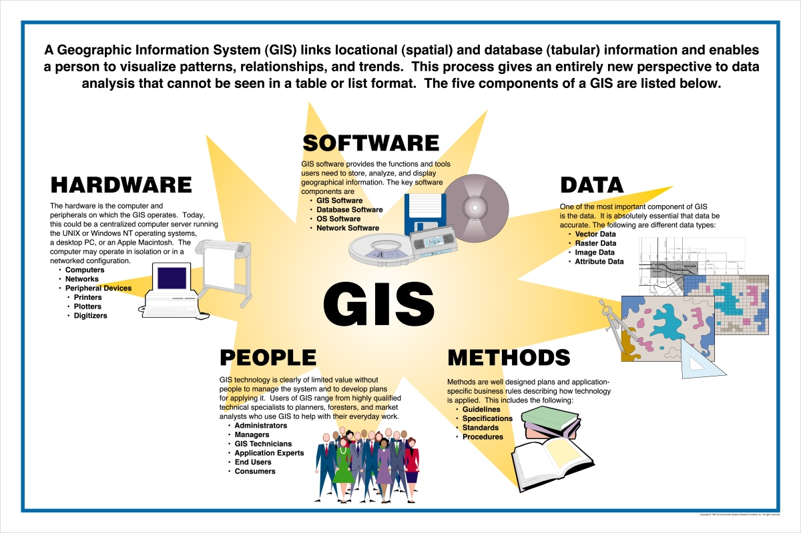
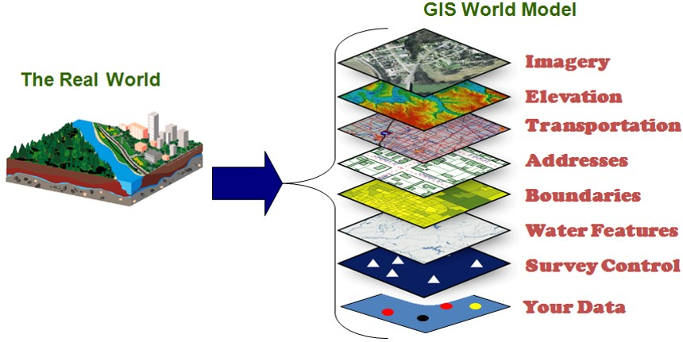
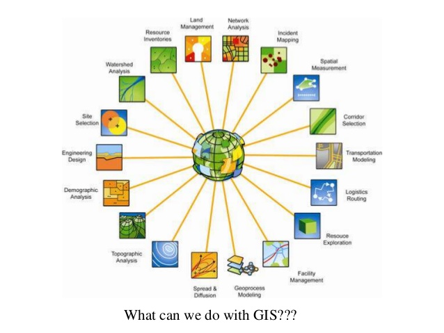
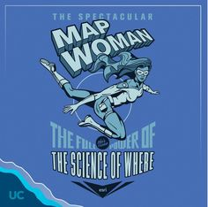

@title[geospatial technologies]
GIS and Geospatial Technologies 
-------------------------------
### @fa[globe fa-5x]
###### D.J. Biddle, GISP
###### Use the @fa[angle-down] and @fa[angle-right] arrows to navigate
---
@title[the plan]
#### the plan
- Everything happens..._________?
- What's in a GIS?
- Discussion: What is GIS to YOU?
---
#### Complete the following statement...
> "Everything happens ..."
+++
> "Everything happens SOMEWHERE!"
+++
#### Geography is...
+++
#### Geography is...

> @size[.6em](Geography is the study of places and the relationships between people and their environments. Geographers explore both the physical properties of Earth’s surface and the human societies spread across it. They also examine how human culture interacts with the natural environment, and the way that locations and places can have an impact on people. Geography seeks to understand where things are found, why they are there, and how they develop and change over time. )
- [National Geographic Society](https://www.nationalgeographic.org/encyclopedia/geography/)
+++
#### The spatial perspective
- Geographers know that where things happen, and how the locations of different people, events, and natural phenomenon relate to each other is KEY in understanding the whole picture.
- Spatial analysis is the framework we use to answer geographic questions
- Geographic Information Systems (GIS) is the tool we use to do spatial analysis!
+++
#### The OG spatial analysis
"You know ~~nothing~~ *where it's at* Jon Snow"

+++

+++
<iframe class="stretch" data-src="https://www.arcgis.com/apps/MapJournal/index.html?appid=781630562fea4ad88e94bd22e161ba06&webmap=f4d1c17a8f1544c8903060a1e329103a"></iframe>
+++
#### It's all too real today...

+++
<iframe class="stretch" data-src="https://gisanddata.maps.arcgis.com/apps/opsdashboard/index.html#/bda7594740fd40299423467b48e9ecf6"></iframe>
+++
### Spatial analysis, in simple terms...
+++
#### Where? questions...
A GIS lets us ask many geographic questions, like...

- Where is it? What area does it cover? (**spatial questions**)
- What is there? How much is there? (**attribute questions**)
- How have the location or attributes changed over time? (**temporal questions**)
+++
#### More questions...
when considering multiple geographic entities...

- Do they overlap? 
- Are they connected to one another? 
- Are they within a certain distance of each other?
- Do they share the same attributes? Where? 
- How do nearby things relate to each other? 
+++
With these questions in mind...
+++
#### A Scenario!
- A dangerous chemical spills from a local factory, threatening the surrounding neighborhoods!
- The chemical spill will affect all residents within 1 mile of the factory
- But! Because the chemical flows downhill, houses that are on higher ground are safe!
- Who do we need to evacuate? 
+++
### Spatial questions...special tools. GIS!
--- 
#### what's a gis? 
> @size[.6em](A geographic information system <GIS> is a framework for gathering, managing, and analyzing data. Rooted in the science of geography, GIS integrates many types of data. It analyzes spatial location and organizes layers of information into visualizations using maps and 3D scenes. ​With this unique capability, GIS reveals deeper insights into data, such as patterns, relationships, and situations—helping users make smarter decisions.) 
###### -Environmental Research Systems Institute (ESRI)
+++
##### A brief history of GIS mapping
<iframe src="https://drive.google.com/file/d/14NXbB7lDR-LTifBCatXSAXXGFQzf1EGU/preview" width="640" height="480"></iframe>
+++
@title[gis components]

+++
@title[gis layers concept]

+++
@title[gis database concept]

+++
### So what can it do??
+++
#### GIS functions to...

@ol
1. Capture data...*through digitizing, georeferencing, or gps*
1. Store and manage data...*in a geodatabase*
1. Analyze data...*by querying and geoprocessing*
1. Display data...*in maps, dashboards, and web apps*
@olend
+++
@title[gis applications]

+++
##### Our Scenario...
- A dangerous chemical spills from a local factory, threatening the surrounding neighborhoods!
- The chemical spill will affect all residents within one mile of the factory
- But! Because the chemical flows downhill, houses that are on higher ground are safe!
- Who do we need to evacuate?
+++
#### Mapwoman to the rescue!

+++
@transition[fade]
- our scenario

+++
@transition[fade]
- 1 mile buffer around site

+++
@transition[fade]
- select buildings with elevation < factory

+++
@transition[fade]
- select buildings with elevation > factory

+++
@transition[fade]
- query land record to identify landowners for call list

---
### Common GIS Applications
+++
##### Demographic Mapping/Social Sciences
- Where are vulnerable populations located?
- How do environmental hazards disproportionately impact different social groups
- Environmental justice? 
+++
@title[demographic mapping example]
[Demographic Mapper](http://www.ulcgis.org/flexviewers/KIPDA_Map)

+++
@title[environmental justice example]
https://ejscreen.epa.gov/mapper/

+++
##### Physical Sciences
- Species habitat mapping/modeling
- Land cover change analysis
- Natural hazards vulnerability 
- Climate change monitoring
+++
Habitat suitability modeling

https://www.biodiversityscience.com/2011/04/27/species-distribution-modelling/
+++
Hazards mapping

https://www.usgs.gov/media/images/national-landslide-hazards-map
+++
Climate change monitoring

https://www.nasa.gov/feature/goddard/2016/arctic-sea-ice-annual-minimum-ties-second-lowest-on-record/
+++
##### Site Selection
- Where should a new business be located?
  - Where are the customers?
  - How far will they have to travel? 
  - Will they buy your product?
  - Where is the competition located?
+++
Site selection

https://www.caliper.com/maptitude/sitelocation/default.htm
+++
Mapping food deserts

<iframe src="https://drive.google.com/file/d/1SPhagEvoAj19Cfx-W5IKE2cin6iVFKj1/preview" width="640" height="480"></iframe>
+++
##### Logistics/Transportation
- How can we minimize transportation costs?
- What is the best route for the UPS truck?
- Do we need a new TARC route due to population growth? 
+++
Vehicle routing

https://www.caliper.com/products/gis-logistics-mapping-software.htm
+++
##### journalism/storytelling
- Story Maps convey place-based narratives about a topic or idea
- Mashups of maps, text, and multimedia in an interactive web applications
- Effective and engaging communication in a web browser
- https://storymaps.esri.com

+++
@title[story map example 1]
<iframe class="stretch" data-src="https://centerforgis.maps.arcgis.com/apps/Cascade/index.html?appid=08c2849d3f1649758e40b8cfa67d0248"></iframe>
+++
@title[story map example 2]
<iframe class="stretch" data-src="https://centerforgis.maps.arcgis.com/apps/MapSeries/index.html?appid=e7fd5854dbab435b944c27913df01980"></iframe>
+++
@title[story map example 3]
<iframe class="stretch" data-src="https://centerforgis.maps.arcgis.com/apps/Cascade/index.html?appid=307e73fffa6f4206b9d356459998b607"></iframe>
+++
##### 1,000 Uses for GIS
There are literally thousands of ways to use GIS to answer questions, create new knowledge, and help people understand their world a little better!
https://gisgeography.com/gis-applications-uses/ 
+++
### What is GIS to YOU? 
Let's use the remainder of the class to share our perspectives on GIS from our own interests...
---

	

 